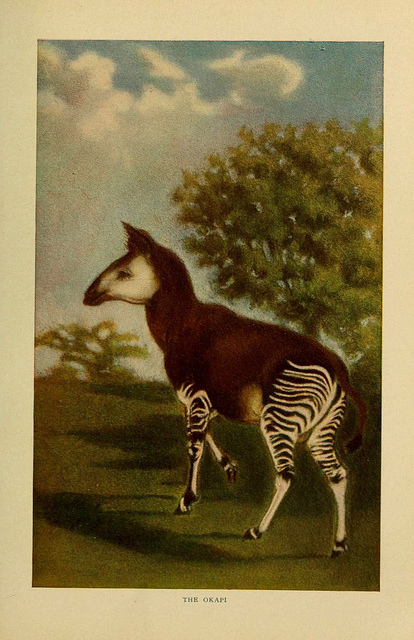

## Biography 

**Ciera Martinez** is a biologist who spent the last ten years studying the evolution of morphology.  During her PhD she explored how plant form develops and now aims to understand how non-coding DNA defines developmental signals during early fruit fly development. She is a Berkeley Institute of Data Science Fellow where she explores her love of all things data. And really likes fancy microscopes and cats. 

 

## Skills

Ciera knows a lot about Plant Biology, Evolution, R, and knitting.

## Awesome Animal Pick

I choose the [Okapi](https://en.wikipedia.org/wiki/Okapi), because it looks like a mix between a two other awesome animals - zebras and giraffes. Also, being an evolutionary biologist I love all organisms considered to be exaples of  "[living fossils](https://en.wikipedia.org/wiki/Living_fossil)"

 
## References

1. Okapi Img 1 [life of animals; the mammals, 1852](https://www.biodiversitylibrary.org/page/39642017#page/1/mode/1up): [Link to page](https://www.flickr.com/photos/biodivlibrary/7171950698/in/album-72157629668095940/)
2. Okapi Img 2: Painting by Sir Harry Johnston (1858-1927), lithograph by P. J. Smit - Proceedings of the Zoological Society, 1901, London, UK [https://archive.org/stream/proceedingsofzoo19012zool#page/n51/mode/2up](Painting by Sir Harry Johnston (1858-1927), lithograph by P. J. Smit - Proceedings of the Zoological Society, 1901, London, UK https://archive.org/stream/proceedingsofzoo19012zool#page/n51/mode/2up)
