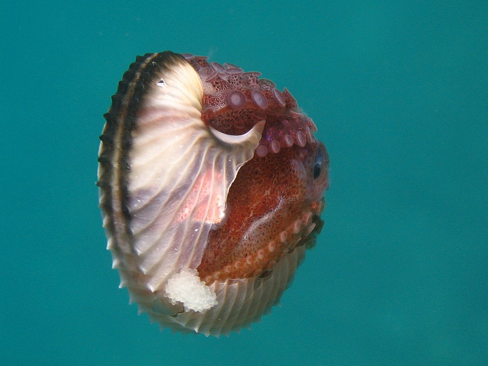

## Biography

**Ollie Downs** is a queer, non-binary biology student at UC Berkeley. Class of 2019! They are super passionate about museums, and want to go to grad school for museum studies. Ollie also loves animals and keeps a collection of dead things, and loves being part of the data science community. Ollie is an RA and also works for the UC Berkeley Division of Data Sciences with their peer advising program.  

 

## Skills

Ollie's skills include using microscopes, preparing museum specimens, studying data, and making visualizations. Ollie also loves to make people laugh, but that's not neccesarily something they're skilled at :)

## Awesome Animal Pick

I love the [Argonaut, or Paper Nautilus!](https://en.wikipedia.org/wiki/Argonaut_(animal)), Paper nautiluses are the only living examples of their family, and are actually octopuses - the only ones with a shell! Their shells are actually egg cases, and they use them to 'gulp' air to facilitate flotation. [Here](https://www.youtube.com/watch?v=SbZePKLDxNk) is an awesome video of one with an equally awesome soundtrack!!!

## Animal Family Member

The Paper Nautilus is part of the [Argonautidae](https://en.wikipedia.org/wiki/Argonautidae) family. This family is interesting because egg cases that have nodes, ribs, and a double keel are characteristic of the Argonauta genus, while all other egg cases that lack these features belong to the other 4 (extinct) genera. Another species in this family was the [Mizuhobaris izumoensis](https://en.wikipedia.org/wiki/Mizuhobaris), which was driven to extinction in 1913.

## References

1. Opossum Image [from Wikipedia](https://commons.wikimedia.org/wiki/File:Opossum_1.jpg) By Cody Pope - Wikipedia:User:Cody.pope, CC BY-SA 2.5, https://commons.wikimedia.org/w/index.php?curid=1702717
2. Argonaut Image [from Wikipedia](https://commons.wikimedia.org/wiki/File:Papierboot_Argonauta_200705181139.jpg) By Bernd Hofmann at de.wikipedia, CC BY-SA 2.0, https://commons.wikimedia.org/w/index.php?curid=4521432
3. Mizuhobaris Image [from Wikipedia](https://upload.wikimedia.org/wikipedia/en/b/b0/Mizuhobaris_izumoensis.jpg?download)
