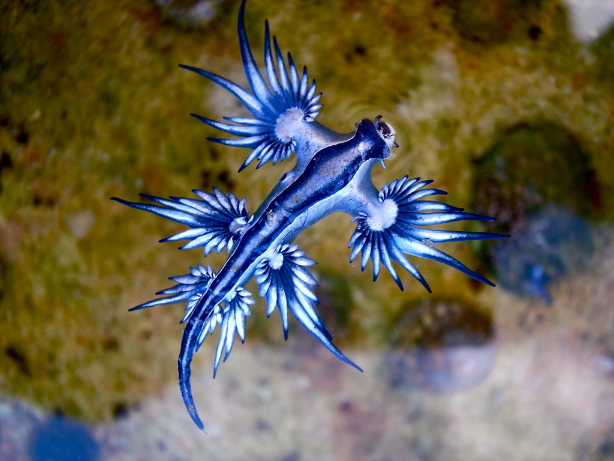

## Biography 

**Samantha Tang** is an undergraduate at UC Berkeley studying Data Science and Statistics. 
She was originally a Nutritional Science major, but after taking an intro class in Data Science, she realized that data was where her passion lies. Outside of school, she enjoys doing jigsaw puzzles and trying different cuisines!

## Skills

Samantha is proficient with Python and is familiar with Scheme, SQL, and Java. She's currently trying to pick up R and HTML as well. 

## Awesome Animal Pick

I chose the [Glaucus atlanticus](https://en.wikipedia.org/wiki/Glaucus_atlanticus) because the slug actually looks like a blue dragon (like its name)! 

 
## References

<!-- 1. Glaucus atlanticus Img 1 [Link to page](blue-dragon-or-floating-sea-slug-glaucus-atlanticus-glaucidae-artwork-by-brigette-james_a-l-13589455-8880731) -->
1. Glaucus atlanticus Img 1 [Link to page](https://en.wikipedia.org/wiki/Glaucus_atlanticus#/media/File:Blue_dragon-glaucus_atlanticus_(8599051974).jpg)

