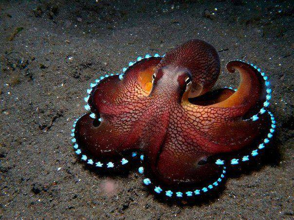

## Biography 

**Zoe Liu** is a sophomore student at UC Berkeley studying Computer Science and Data Science. 

## Skills

Zoe is proficient with Java, Python, Scheme, and HTML. She is familiar with Adobe Illustrator and Tableau and would like to learn R and C within the next year. She is also a piano and flute player, and helps build solar cars on campus.

## Awesome Animal Pick

I choose the [coconut octopus](https://en.wikipedia.org/wiki/Amphioctopus_marginatus), because I admire the intelligence and beauty of octopi. The coconut octopus gathered coconut shells and carries them around for shelter! They have also been observed gathering tools like shells for defense and concealment, and are beautiful creatures on top of all that.

 
## References

1. Coconut Octopus Img 1 [Link](http://www.animalspot.net/wp-content/uploads/2017/05/Blue-Glowing-Coconut-Octopus.jpg)
